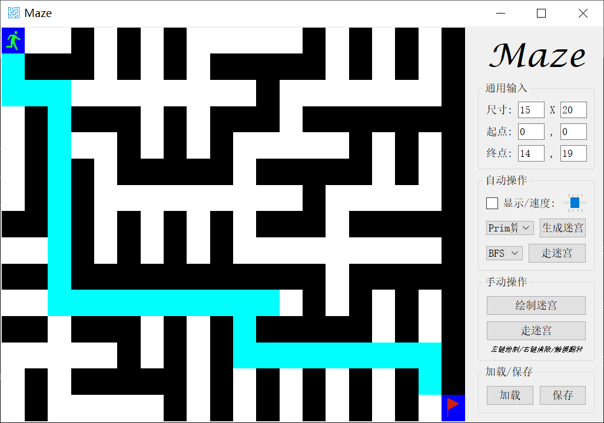
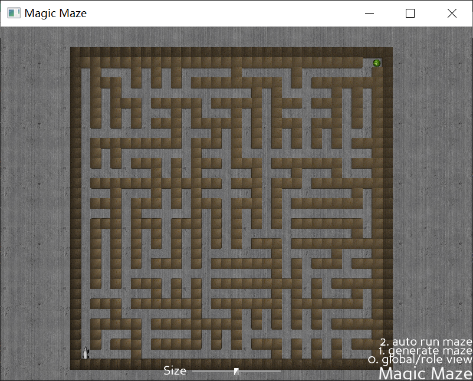

# magic_maze

#### 介绍

迷宫游戏

#### 项目目的

娃最近迷恋迷宫游戏，买的迷宫书走完就没了，他表示还没玩够。

所以就做了这个迷宫游戏，可以实现随机生成迷宫、走迷宫、显示答案等效果，让他可以无限玩。

二维版本的玩腻了，小孩子还是比较喜欢有故事情节的迷宫，又追加做了三维视图模式(姑且叫: 好饿的熊猫找竹叶球吃)。


#### 安装使用

+ [源码](https://github.com/HeLiangHIT/magic_maze)安装: `git clone https://github.com/HeLiangHIT/magic_maze.git && cd magic_maze && python setup.py install`
+ pip源安装: `pip install magic_maze` 源地址 https://pypi.org/project/magic-maze/
+ ~~下载可执行文件: 到 https://github.com/HeLiangHIT/magic_maze/releases 下载可执行文件~~
+ 查看帮助使用: 源码 `python main.py --help`/ 二进制 `maze --help`
    * 支持自动生成迷宫、寻找最佳路径，且动态显示迷宫生成和搜索过程
    * 支持手动绘制迷宫(鼠标左键绘制通道、右键绘制墙体)、走迷宫(鼠标左键走、右键取消)
    * `maze -d 2d` 运行二维视图的迷宫
    * `maze -d 3d` 运行三维视图的迷宫

 


#### 软件架构

+ 核心目录结构解释:
    * algorithm 里面核心算法已抽象为通用接口，以支持扩展多种界面展现方式，详情查看[帮助文档](./doc/algorithm.txt)
```py
magic_maze
├── README.md # 项目介绍
├── algorithm # 核心算法和数据结构实现
├── demo # 使用示例模型等
├── doc # 帮助文档，主要基于 script/generate_doc.sh 脚本在提交时自动生成
├── main.py # 主程序
├── requirement.txt # 依赖
├── script # 单元测试、帮助文档生成等自动化脚本
└── ui # pyqt/panda3d 的 UI 主程序
```
